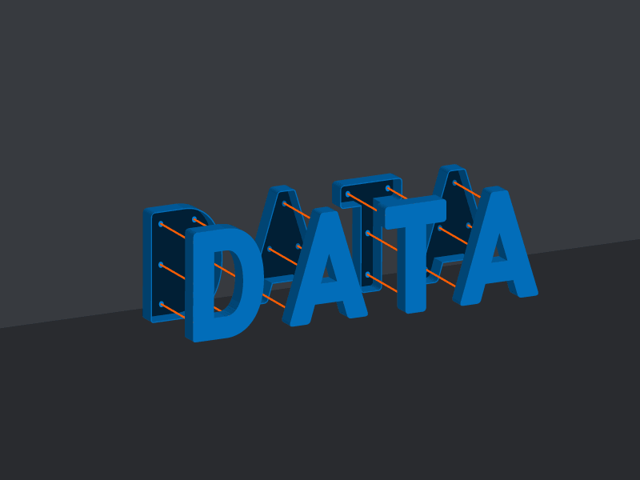
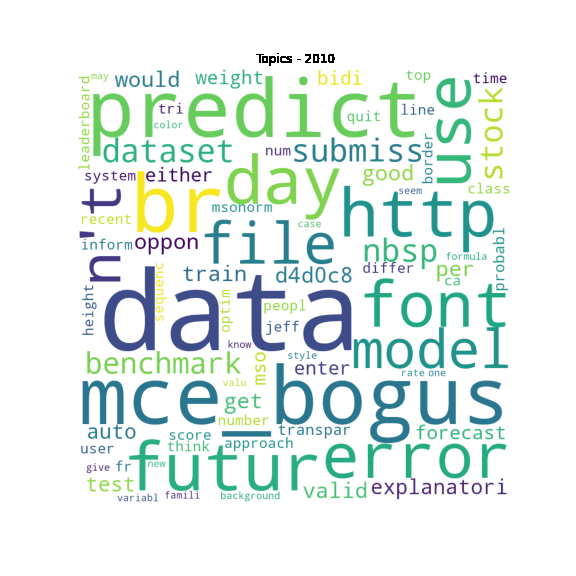

# The-Art-of-Analyzing-Big-Data

This repository includes all tasks' notebooks, final project, and final exam work created as part of the Ben-Gurion University of the Negev course "The Art of Analyzing Big Data". 

The course covers techniques for mining massive datasets. In this course, we learned how to perform common tasks, such as classification, clustering analysis, and analysis of large datasets. Each of the tasks tackles different machine learning and big data issues. [Course web site](https://data4goodlab.github.io/lectures.html).

---
## [Final Exam Work](The_Art_of_Analyzing_Big_Data_Take_Home_Exam.ipynb)

In the notebook, I tackled four different tasks.

### Covid-19 data analysis. 
In this question, we were asked to find a way to describe the spread of the coronavirus over a specific country, chosen from a list of ~200 countries. My chosen country is South Africa. We were asked to show the affect of the 4th/5th COVID wave on three disciplines of our choice (education system, public transportation, health system, employment, etc.) in compare to the 1st/2nd COVID wave.

### Communities Identification
In this question, we were told to use Kaggle Meta dataset to build a social network of the users. Then, I applied networkx's communities identification algorithm. 

### Forums Topic Models
Using forums posts data, I had to find the topics discussed each year. I did it by building a topic model for each year (nltk, turicreate), and then displayed it on a worldcloud.

### Olympic Medals analysis - 
In this question, we were asked to propose a method for finding remarkable performances of olympic athletes, and a way to detect surprising results on the olympic games. I performed clustering in order to achive the question's requirements. Clustering enables us to find the gold, silver or bronze medal athletes, that should be spatialy closed to each other in the matching cluster-centers. It can also help us to identify extraordinary performance of an athlete- the sample of this athlete will be very far from the clusters centers. The pipeline contains PCA for dimensionality reduction, and k-means using the PC copmuted components.

